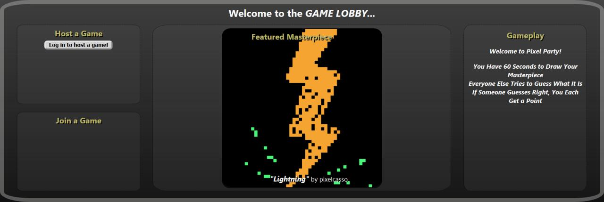

# PIXEL PARTY!

Pixel Party is a student project by:
* [Pete Jones](https://github.com/pjz987/)
* [Talieson Solmon](https://github.com/Tallieson)
* [Billy Barnett](https://github.com/barnetb)
* [Sam Purdy](https://github.com/Solaros711)
* [Charlie Villanueva](https://github.com/seanyboy1)

Pixel Party is a multiplayer guess-the-drawing game with pixel art.

